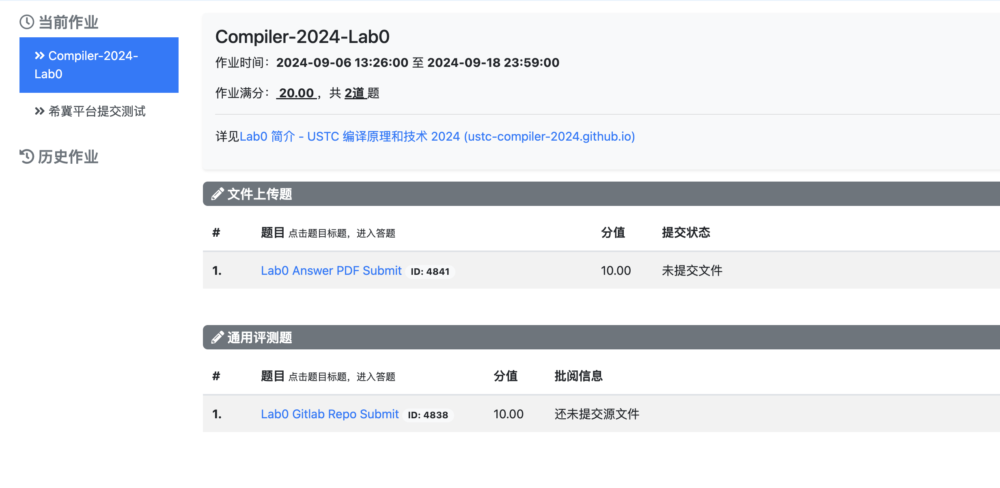
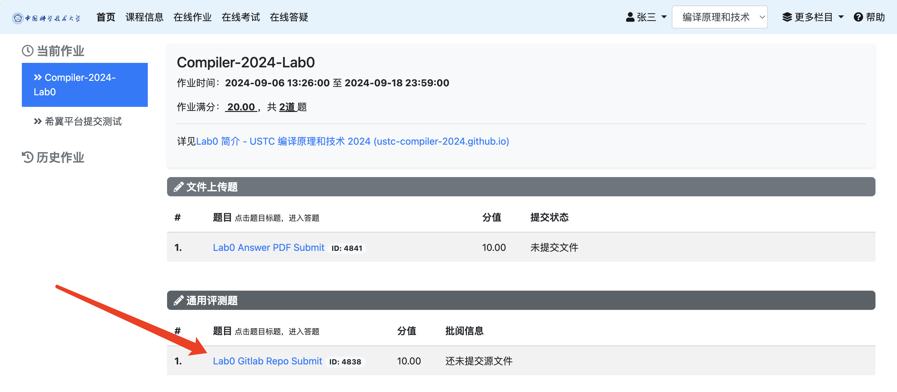
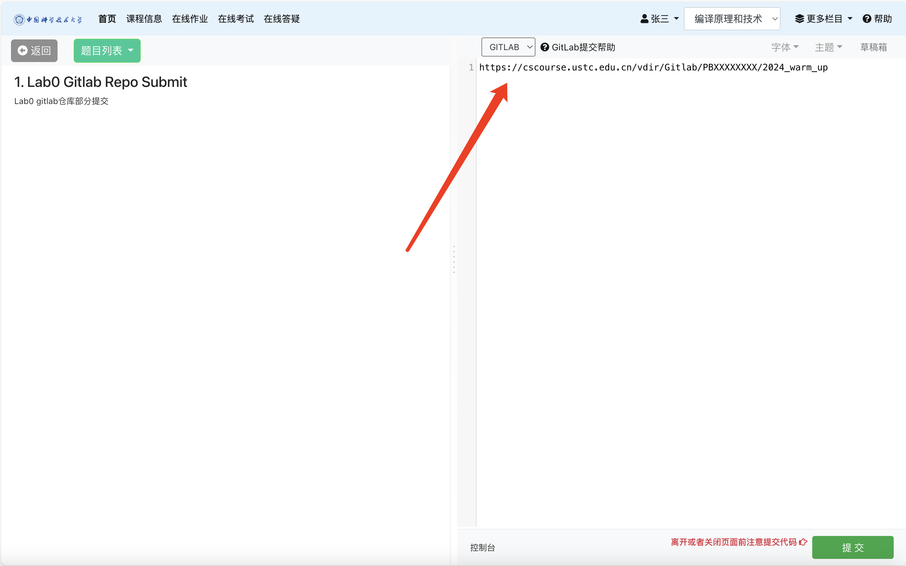
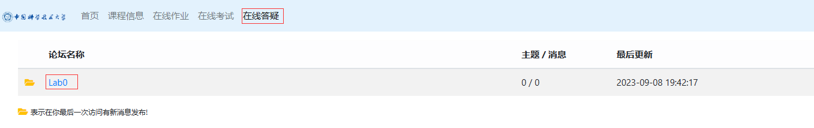

# Lab0 实验准备

!!! warning "Deadline"

    **2025 年 3 月 23 日 23:59**

本次实验用于指导同学们进行环境的搭建以及带领同学们熟悉实验中常用的 C++ 特性以及 Git 的操作，主要有以下内容：

- 搭建 Ubuntu 22.04 虚拟机环境并下载本课程所需软件包
- 测试环境配置是否成功
- 了解基本的 C++ STL(标准模版库) 使用
- 掌握大型 CMake 项目的 Debug 方法

## 文档

- [Linux 环境配置](linux.md)
- [LLVM 等软件环境配置](software.md)
- [C++ 常见语法](cpp.md)
- [在 CMake 构建的大型项目中如何 Debug](debug.md)

## 实验内容

### 实验一：LLVM 环境测试

阅读文档 [Linux 环境配置](linux.md) 和 [LLVM 等软件环境配置](software.md)，生成 Test.ll 文件。

### 实验二：C++ & Debug

阅读文档 [C++ 常见语法](cpp.md) & [在 CMake 构建的大型项目中如何 Debug](debug.md)。

### 提交内容

请提交[在 CMake 构建的大型项目中如何 Debug](debug.md)中对三个问题的回答至两位助教的邮箱。

<!-- ## 实验要求
#### 文件上传提交方式

对于上传的文件，助教会进行文本相似性检测，请同学们认真学习并完成要求。

#### GitLab 仓库链接提交方式

-->

<!-- #### 答疑

同学们如果对实验有什么疑问，请先登录希冀平台后在 [在线答疑模块](https://cscourse.ustc.edu.cn/forum/forum.jsp?forum=121) 发帖询问，助教看到帖子会及时回复。
 --> 
